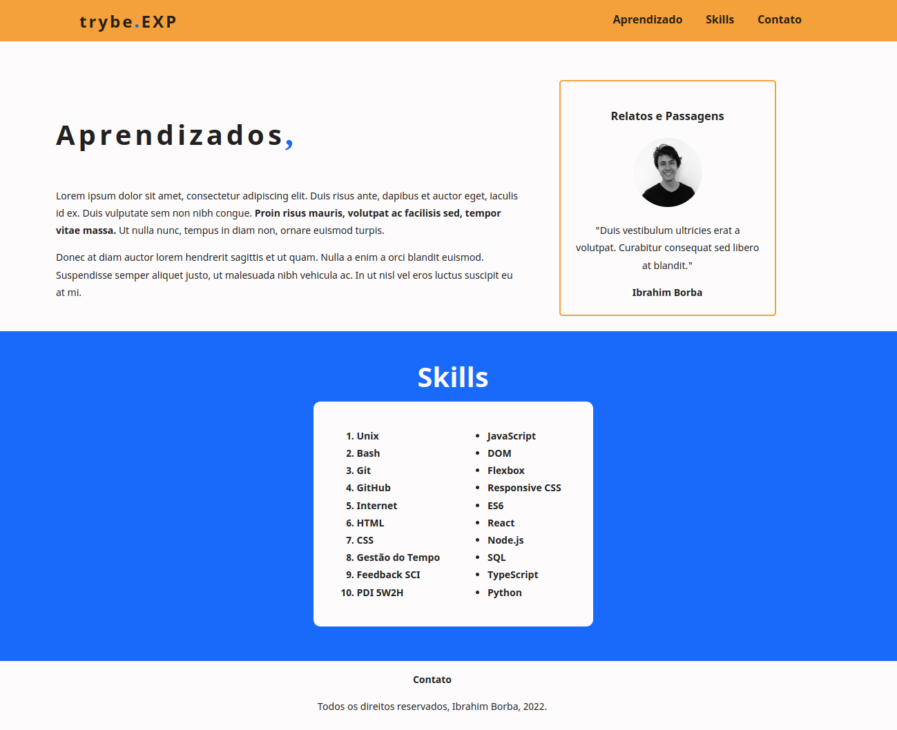

# PROJETO - LESSONS LEARNED

Criação de um site do zero utilizando as principais tags HTML para compor a estrutura de uma página e irá estilizar e alterar o posicionamento dos componentes através de CSS. Objetivos do projeto: 
&nbsp;
1. Entender como funciona a estrutura (HTML) de uma página

2. Entender como o estilo (CSS) é aplicado à página

3. Construir páginas utilizando HTML e CSS

4. Realizar manutenções em páginas já existentes

5. Aplicar Layout e Box Model na prática

&nbsp;

### Projeto entregue

&nbsp;

